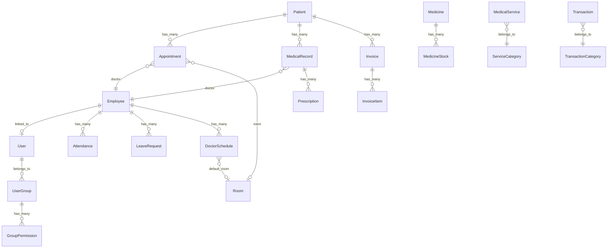

# 🏥 Hula Clinic ERP — System Architecture

> **Phiên bản**: 1.0.0  
> **Cập nhật lần cuối**: 2026-03-01  
> **Mô tả**: Hệ thống quản lý phòng khám (Clinic ERP) với đầy đủ tính năng quản lý bệnh nhân, lịch hẹn, bệnh án, kho thuốc, dịch vụ, thanh toán, tài chính, nhân sự, và quản trị hệ thống.

---

## 1. Tổng quan hệ thống

Hula Clinic ERP là hệ thống **monorepo** gồm:

| Thành phần | Công nghệ | Mô tả |
|---|---|---|
| **Backend API** | NestJS 10 + TypeORM + PostgreSQL | REST API, JWT Auth, AES-256 Encryption |
| **Frontend SPA** | React 18 + Vite 5 + Ant Design 5 | Single Page App, Dark Theme, 10 pages |
| **Database** | PostgreSQL 15 | Lưu trữ dữ liệu chính |
| **Deployment** | Docker Compose + Nginx | 3 containers: `db`, `app`, `frontend` |

### Kiến trúc tổng thể

```
┌─────────────────────────────────────────────────────────────┐
│                      NGINX (port 80)                        │
│  /api, /uploads → proxy → clinic_app:3000                   │
│  / → serve static SPA files                                 │
├─────────────────────────────────────────────────────────────┤
│                                                             │
│  ┌──────────────────┐          ┌──────────────────────┐     │
│  │  Frontend (SPA)  │  ──────→ │  Backend (NestJS)    │     │
│  │  React + Vite    │  /api/*  │  port 3000           │     │
│  │  Ant Design      │          │  JWT Auth             │     │
│  │  port 5173 (dev) │          │  TypeORM              │     │
│  └──────────────────┘          └─────────┬────────────┘     │
│                                          │                  │
│                                ┌─────────▼────────────┐     │
│                                │  PostgreSQL 15        │     │
│                                │  port 5432 (int)      │     │
│                                │  5433 (ext)           │     │
│                                └──────────────────────┘     │
└─────────────────────────────────────────────────────────────┘
```

---

## 2. Cấu trúc thư mục

```
hula-clinic/
├── src/                          # Backend (NestJS)
│   ├── main.ts                   # Bootstrap, CORS, prefix /api
│   ├── app.module.ts             # Root module, kết nối tất cả modules + entities
│   ├── config/
│   │   └── industry.config.ts    # Cấu hình ngành (clinic), multi-industry ready
│   ├── common/                   # Shared utilities
│   │   ├── encryption/           # AES-256-GCM encryption service + transformer
│   │   ├── guards/               # Feature flag guard
│   │   └── interceptors/         # Activity logging + User context injection
│   ├── core/                     # Core modules (luôn load)
│   │   ├── auth/                 # JWT Authentication
│   │   ├── users/                # User + UserGroup + Permission management
│   │   ├── feature-flags/        # Feature flag toggle
│   │   ├── notifications/        # Notification system
│   │   ├── system/               # System config + Activity log
│   │   ├── finance/              # Transaction + Category management
│   │   ├── hr/                   # Employee, Attendance, Leave, WorkShift
│   │   ├── tasks/                # Task management
│   │   └── upload/               # File upload (sharp image processing)
│   └── clinic/                   # Clinic-specific modules
│       ├── patients/             # Patient management (encrypted PII)
│       ├── appointments/         # Appointment scheduling (+ room booking)
│       ├── medical-records/      # EMR: Medical records + Prescriptions
│       ├── pharmacy/             # Medicine + Stock management
│       ├── services/             # Medical service + Category catalog
│       ├── billing/              # Invoice + InvoiceItem billing
│       ├── rooms/                # Room management + availability
│       └── doctors/              # Doctor schedules + availability
│
├── frontend/                     # Frontend (React + Vite)
│   ├── src/
│   │   ├── main.tsx              # React entry point
│   │   ├── App.tsx               # Router, Layout, Auth guard, Menu
│   │   ├── config.ts             # API URL configuration
│   │   ├── utils/
│   │   │   └── api.ts            # Axios instance + interceptors (JWT, 401 redirect)
│   │   └── pages/
│   │       ├── LoginPage.tsx     # Đăng nhập
│   │       ├── DashboardPage.tsx # Bảng điều khiển
│   │       ├── PatientsPage.tsx  # Quản lý bệnh nhân
│   │       ├── AppointmentsPage.tsx  # Quản lý lịch hẹn (+ book phòng)
│   │       ├── MedicalRecordsPage.tsx # Bệnh án
│   │       ├── PharmacyPage.tsx  # Kho thuốc
│   │       ├── ServicesPage.tsx  # Dịch vụ y tế
│   │       ├── BillingPage.tsx   # Thanh toán / hóa đơn
│   │       ├── DoctorsPage.tsx   # Quản lý bác sĩ + lịch làm việc
│   │       └── RoomsPage.tsx     # Quản lý phòng khám
│   ├── vite.config.ts            # Dev proxy /api → localhost:3001
│   ├── Dockerfile                # Multi-stage: dev / build / nginx production
│   └── nginx.conf                # Reverse proxy to backend
│
├── docker-compose.yml            # 3 services: db, app, frontend
├── Dockerfile                    # Backend multi-stage: base / dev / build / prod
├── package.json                  # NestJS dependencies
├── tsconfig.json                 # TypeScript config (ES2021, CommonJS)
└── .env.example                  # Environment variables template
```

---

## 3. Backend Architecture

### 3.1 Module Organization

Backend chia thành 2 layer chính:

#### Core Modules (luôn được load)

| Module | Controller | Service | Entities | Chức năng |
|---|---|---|---|---|
| `AuthModule` | `auth.controller` | `auth.service` | — | Login, JWT token generation |
| `UsersModule` | `users.controller` | `users.service` | `User`, `UserGroup`, `GroupPermission` | Quản lý tài khoản, nhóm, quyền |
| `FeatureFlagModule` | `feature-flag.controller` | `feature-flag.service` | `FeatureFlag` | Bật/tắt tính năng |
| `NotificationsModule` | `notifications.controller` | `notifications.service` | `Notification` | Hệ thống thông báo |
| `SystemModule` | `system.controller` | `system.service` | `SystemConfig`, `ActivityLog` | Cấu hình hệ thống + log hoạt động |
| `FinanceModule` | `finance.controller` | `finance.service` | `Transaction`, `TransactionCategory` | Thu/chi tài chính |
| `HrModule` | `hr.controller` | `hr.service` | `Employee`, `Attendance`, `LeaveRequest`, `WorkShift` | Quản lý nhân sự |
| `TasksModule` | `tasks.controller` | `tasks.service` | `Task` | Quản lý công việc |
| `UploadModule` | `upload.controller` | `upload.service` | — | Upload file, xử lý ảnh (sharp) |

#### Clinic Modules (industry-specific)

| Module | Controller | Service | Entities | Chức năng |
|---|---|---|---|---|
| `PatientsModule` | `patients.controller` | `patients.service` | `Patient` | Quản lý bệnh nhân (PII encrypted) |
| `AppointmentsModule` | `appointments.controller` | `appointments.service` | `Appointment` | Đặt lịch hẹn khám |
| `MedicalRecordsModule` | `medical-records.controller` | `medical-records.service` | `MedicalRecord`, `Prescription` | Bệnh án điện tử (EMR) |
| `PharmacyModule` | `pharmacy.controller` | `pharmacy.service` | `Medicine`, `MedicineStock` | Quản lý thuốc + tồn kho |
| `ServicesModule` | `services.controller` | `services.service` | `MedicalService`, `ServiceCategory` | Dịch vụ y tế + danh mục |
| `BillingModule` | `billing.controller` | `billing.service` | `Invoice`, `InvoiceItem` | Hóa đơn, thanh toán |
| `RoomsModule` | `rooms.controller` | `rooms.service` | `Room` | Quản lý phòng khám + check trống |
| `DoctorsModule` | `doctors.controller` | `doctors.service` | `DoctorSchedule` | Lịch BS + check trống |

### 3.2 Database Entities (22 entities)



### 3.3 Entity Details

#### Patient (Bệnh nhân)
- **Encrypted fields** (AES-256-GCM): `phone`, `email`, `address`, `id_number`, `insurance_number`, `emergency_contact_phone`
- **Key fields**: `patient_code` (unique), `full_name`, `date_of_birth`, `gender`, `blood_type`, `allergies`, `medical_history`
- **Insurance**: `insurance_number`, `insurance_provider`, `insurance_expiry`

#### Appointment (Lịch hẹn)
- **Status flow**: `BOOKED` → `CONFIRMED` → `CHECKED_IN` → `IN_PROGRESS` → `COMPLETED` / `CANCELLED` / `NO_SHOW`
- **Relations**: `Patient` (required), `Employee` as doctor (optional), `Room` (optional)
- **Conflict checks**: Kiểm tra trùng giờ bác sĩ + trùng phòng khi tạo
- **Key fields**: `appointment_code`, `service_name`, `appointment_date`, `start_time`, `end_time`, `room_id`

#### Room (Phòng khám) — NEW
- **Types**: `KHAM`, `THU_THUAT`, `XET_NGHIEM`, `TIEM`, `OTHER`
- **Status**: `ACTIVE`, `INACTIVE`, `MAINTENANCE`
- **Key fields**: `room_code` (auto-gen), `name`, `floor`, `type`, `capacity`, `equipment`
- **Availability**: Service kiểm tra phòng trống theo ngày/giờ dựa trên appointments

#### DoctorSchedule (Lịch bác sĩ) — NEW
- **Mô tả**: Lịch làm việc tuần của bác sĩ (Employee có position Bác sĩ)
- **Key fields**: `employee_id`, `day_of_week` (0–6), `start_time`, `end_time`, `room_id` (phòng mặc định)
- **Availability**: Service kiểm tra bác sĩ trống = có lịch ngày đó + không trùng appointment

#### MedicalRecord (Bệnh án)
- **Status**: `DRAFT` → `COMPLETED`
- **Vital signs** (JSONB): `blood_pressure`, `heart_rate`, `temperature`, `weight`, `height`, `spo2`
- **Relations**: `Patient`, `Employee` (doctor), `Prescription[]` (cascade)
- **Key fields**: `record_code`, `symptoms`, `diagnosis`, `diagnosis_code`, `treatment_plan`, `follow_up_date`

#### Invoice (Hóa đơn)
- **Payment status**: `UNPAID` → `PARTIAL` → `PAID`
- **Document status**: `DRAFT` → `CONFIRMED` → `PAID` → `CANCELLED`
- **Payment methods**: `CASH`, `CARD`, `TRANSFER`, `MIXED`
- **Amounts**: `total_amount`, `discount_amount`, `insurance_amount`, `patient_amount`, `paid_amount`

#### Employee (Nhân viên)
- **Encrypted fields**: `phone`, `email`, `address`, `id_number`, `bank_account`
- **Linked to**: `User` (optional), `WorkShift`
- **Key fields**: `employee_code`, `position`, `department`, `base_salary`, `join_date`

### 3.4 Authentication & Security

```
┌──────────┐     POST /api/auth/login      ┌──────────────┐
│ Frontend │  ──────────────────────────→   │ AuthController│
│ (React)  │  { username, password }        │              │
│          │                                │ AuthService   │
│          │  ←──────────────────────────   │ validate →    │
│          │  { access_token, user }        │ bcrypt compare│
│          │                                │ JwtService    │
│          │  ──────────────────────────→   │ sign token    │
│          │  Authorization: Bearer <JWT>   └──────────────┘
│          │                                       │
│          │  (All subsequent API calls)           │
│          │  Intercepted by JwtAuthGuard           │
│          │  → jwt.strategy.ts → validate()       │
└──────────┘                                       │
```

**JWT Payload**: `{ username, sub (user_id), group_id, full_name }`  
**Token Expiry**: Configurable via `JWT_EXPIRES_IN` (default: `7d`)

#### Data Encryption (Patient PII)
- **Algorithm**: AES-256-GCM
- **Encrypted at rest**: `phone`, `email`, `address`, `id_number`, `insurance_number`, `emergency_contact_phone`, `bank_account`
- **Format**: `enc:<iv_hex>:<authTag_hex>:<ciphertext_hex>`
- **TypeORM Transformer**: `EncryptedColumnTransformer` — auto encrypt/decrypt khi read/write

### 3.5 Global Interceptors

| Interceptor | Mục đích |
|---|---|
| `ActivityInterceptor` | Log mọi request `POST/PUT/PATCH/DELETE` kèm user info |
| `UserContextInterceptor` | Inject user context vào request |

### 3.6 Feature Flags

- `FeatureFlagGuard`: Check feature flags trước khi cho phép truy cập endpoint
- `FeatureFlagService`: CRUD feature flags (enable/disable tính năng)
- Lưu trong DB table `feature_flags`

---

## 4. Frontend Architecture

### 4.1 Tech Stack

| Thành phần | Version | Vai trò |
|---|---|---|
| React | 18.2 | UI framework |
| Vite | 5.0 | Bundler + Dev server |
| Ant Design | 5.12 | UI component library |
| React Router DOM | 6.20 | Client-side routing |
| Axios | 1.6 | HTTP client |
| Day.js | 1.11 | Date formatting |

### 4.2 Theme & Design

- **Dark theme** (Ant Design `darkAlgorithm`)
- **Primary color**: `#0891b2` (cyan)
- **Font**: Inter
- **Background**: `#0f172a` (content), `#1e293b` (cards/header)
- **Borders**: `#334155`

### 4.3 Page Structure & Routing

```
/login          → LoginPage         (public, auth guard)
/               → DashboardPage     (protected)
/patients       → PatientsPage      ✅ Implemented
/appointments   → AppointmentsPage  ✅ Implemented (+ book phòng)
/medical-records→ MedicalRecordsPage ✅ Implemented
/pharmacy       → PharmacyPage      ✅ Implemented
/services       → ServicesPage      ✅ Implemented
/billing        → BillingPage       ✅ Implemented
/doctors        → DoctorsPage       ✅ Implemented (quản lý BS + lịch)
/rooms          → RoomsPage         ✅ Implemented (quản lý phòng)
/finance        → PlaceholderPage   ⏳ Phase 2
/hr             → PlaceholderPage   ⏳ Phase 2
/tasks          → PlaceholderPage   ⏳ Phase 2
/users          → PlaceholderPage   ⏳ Phase 2
/settings       → PlaceholderPage   ⏳ Phase 2
```

### 4.4 Sidebar Menu

Gồm 3 nhóm:

1. **PHÒNG KHÁM**: Bệnh nhân, Lịch hẹn, Bệnh án, Kho thuốc, Dịch vụ, Thanh toán, Bác sĩ, Phòng khám
2. **QUẢN LÝ**: Tài chính, Nhân sự, Công việc
3. **HỆ THỐNG**: Tài khoản, Cài đặt

### 4.5 API Communication

- **Base instance**: `axios.create({ baseURL: '/api' })`
- **Request interceptor**: Auto-attach `Authorization: Bearer <token>` từ `localStorage`
- **Response interceptor**: Auto-redirect `/login` khi nhận HTTP 401
- **Dev proxy**: Vite proxy `/api` → `http://localhost:3001`

---

## 5. Deployment & Infrastructure

### 5.1 Docker Compose (3 services)

```yaml
services:
  db:           # PostgreSQL 15 — port 5433:5432
  app:          # NestJS Backend — port 3001:3000
  frontend:     # Nginx + React SPA — port 80
```

### 5.2 Networking

| Network | Mục đích |
|---|---|
| `default` (bridge) | Internal: db ↔ app ↔ frontend |
| `proxy_net` (external) | Reverse proxy (VIRTUAL_HOST) |
| `nexus-network` (external) | Shared network với hệ thống khác |

### 5.3 Production Domain

- **Domain**: `clinic.nemmamnon.com`
- **Nginx**: Reverse proxy `/api` → `clinic_app:3000`, serve SPA tại `/`
- **CORS**: Hỗ trợ `localhost:3001`, `localhost:5173`, `clinic.nemmamnon.com`

### 5.4 Environment Variables

| Variable | Mô tả |
|---|---|
| `DB_HOST`, `DB_PORT`, `DB_USERNAME`, `DB_PASSWORD`, `DB_DATABASE` | PostgreSQL connection |
| `JWT_SECRET` | Secret key cho JWT |
| `JWT_EXPIRES_IN` | Thời gian hết hạn token (default: `7d`) |
| `INDUSTRY_TYPE` | Loại ngành (hiện tại: `clinic`) |
| `PORT` | Port backend (default: `3000`) |
| `ENCRYPTION_KEY` | 64-char hex key cho AES-256-GCM |

---

## 6. Data Flow — Luồng nghiệp vụ chính

### 6.1 Quy trình khám bệnh

```
1. Tiếp nhận bệnh nhân
   └── PatientsModule → tạo/tìm Patient

2. Đặt lịch hẹn (BOOK PHÒNG + BOOK BÁC SĨ)
   └── AppointmentsModule → tạo Appointment
   └── Chọn ngày/giờ → hệ thống gợi ý:
       ├── Bác sĩ trống lịch (DoctorsService.findAvailable)
       └── Phòng trống (RoomsService.findAvailable)
   └── Kiểm tra conflict: trùng giờ bác sĩ / trùng phòng → báo lỗi
   └── Appointment status: BOOKED
   └── Notify bác sĩ về lịch hẹn mới

3. Check-in (SD2)
   └── POST /appointments/:id/check-in
   └── Ghi checked_in_at = now()
   └── Status: BOOKED → CHECKED_IN
   └── Notify bác sĩ: "Bệnh nhân đã đến"

4. Bắt đầu khám (SD2)
   └── POST /appointments/:id/start
   └── Status: CHECKED_IN → IN_PROGRESS
   └── Auto-create draft MedicalRecord (mã BA-xxxxxx)
   └── Link medical_record_id vào appointment

5. Kê đơn + Xuất thuốc (SD3)
   └── MedicalRecordsModule → thêm Prescription items
   └── POST /pharmacy/dispense-prescription {prescription_ids}
   └── FIFO stock deduction + mark dispensed = true
   └── Trả về {dispensed, failed} nếu không đủ tồn kho

6. Hoàn thành khám
   └── POST /appointments/:id/complete
   └── Status: IN_PROGRESS → COMPLETED
   └── Auto-complete linked MedicalRecord

7. Thanh toán (SD4)
   └── BillingModule → tạo Invoice + InvoiceItems
   └── POST /billing/:id/pay {amount, method}
   └── Auto-create finance transaction
   └── Notification receipt khi PAID

8. Hủy lịch hẹn (SD5)
   └── POST /appointments/:id/cancel {reason}
   └── Status: → CANCELLED + reason
   └── Notify bác sĩ về lịch hẹn bị hủy

9. Sửa lịch bác sĩ (SD6)
   └── GET /doctors/:id/schedule-impact → danh sách appointments bị ảnh hưởng
   └── DELETE /doctors/schedules/:id → cảnh báo nếu có impact
```

### 6.2 Quy trình quản lý kho thuốc

```
Medicine (danh mục thuốc)
  ├── code, name, generic_name, category
  ├── unit, manufacturer
  ├── import_price, sell_price
  └── requires_prescription

MedicineStock (nhập/xuất kho)
  ├── medicine_id → Medicine
  ├── batch_number, quantity
  ├── import_date, expiry_date
  └── type: IMPORT / EXPORT / ADJUST
```

---

## 7. Trạng thái phát triển

### ✅ Phase 1 — Đã hoàn thành

| Module | Backend | Frontend |
|---|---|---|
| Authentication (JWT) | ✅ | ✅ |
| Patient Management | ✅ | ✅ |
| Appointment Scheduling (+ Room) | ✅ | ✅ |
| Medical Records (EMR) | ✅ | ✅ |
| Pharmacy & Stock | ✅ | ✅ |
| Medical Services | ✅ | ✅ |
| Billing & Invoicing | ✅ | ✅ |
| Doctor Management & Schedules | ✅ | ✅ |
| Room Management | ✅ | ✅ |
| Data Encryption (PII) | ✅ | N/A |
| File Upload | ✅ | N/A |
| Feature Flags | ✅ | N/A |
| Activity Logging | ✅ | N/A |

### ⏳ Phase 2 — Cần phát triển Frontend

| Module | Backend | Frontend |
|---|---|---|
| Finance (Thu/Chi) | ✅ | ❌ Placeholder |
| HR (Nhân sự) | ✅ | ❌ Placeholder |
| Tasks (Công việc) | ✅ | ❌ Placeholder |
| Users & Groups | ✅ | ❌ Placeholder |
| System Settings | ✅ | ❌ Placeholder |
| Notifications | ✅ | ❌ Placeholder |

---

## 8. Quy ước & Chuẩn code

### Backend
- **Pattern**: Module → Controller → Service → Entity (NestJS standard)
- **Naming**: `kebab-case` cho files, `PascalCase` cho class
- **API prefix**: `/api` (global)
- **Database**: TypeORM `synchronize: true` (auto-create tables — chỉ dùng cho dev)
- **Validation**: `class-validator` + `class-transformer`
- **Body limit**: 50MB (hỗ trợ upload ảnh lớn)

### Frontend
- **Routing**: React Router v6, flat page-level routes
- **State**: Local state (`useState`) + `localStorage` cho auth
- **API calls**: Centralized via `utils/api.ts` (Axios instance)
- **UI**: Ant Design components, dark theme
- **No global state manager** (Redux/Zustand chưa sử dụng)

### Security
- **PII Encryption**: AES-256-GCM at database level via TypeORM transformer
- **Password**: bcrypt hash
- **JWT**: Passport strategy, guard on protected routes
- **CORS**: Whitelist specific origins

---

## 9. Hướng dẫn chạy

### Development

```bash
# 1. Clone & setup env
cp .env.example .env
# Edit .env with your values

# 2. Start với Docker
docker compose up -d

# 3. Hoặc chạy riêng:
# Backend (port 3001 mapped)
npm install
npm run start:dev

# Frontend (port 5173)
cd frontend && npm install && npm run dev
```

### Production

```bash
docker compose up -d --build
# Frontend nginx serves SPA at port 80
# Backend at port 3001 (internal 3000)
# DB at port 5433 (internal 5432)
```
